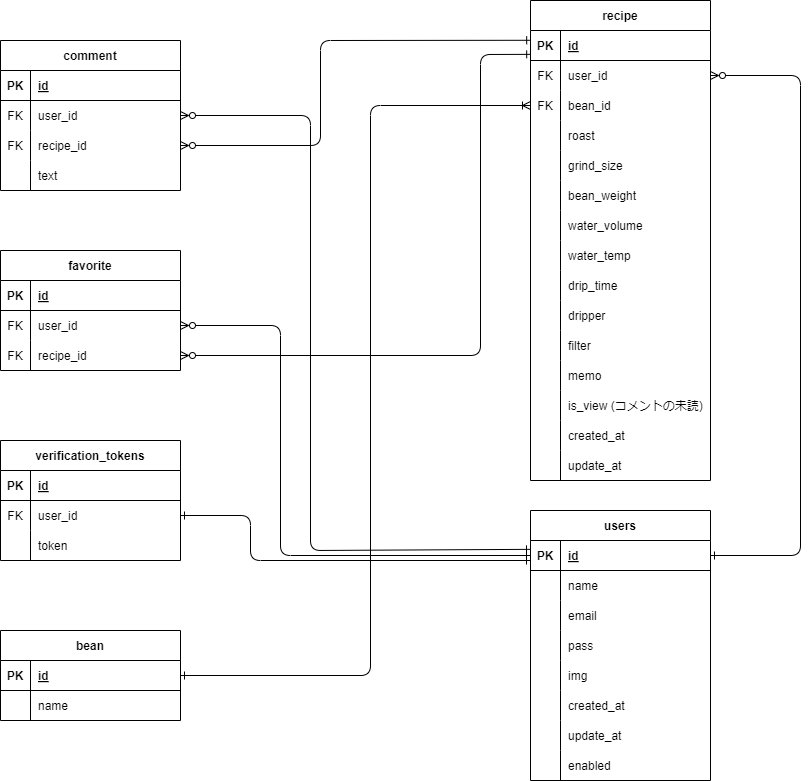
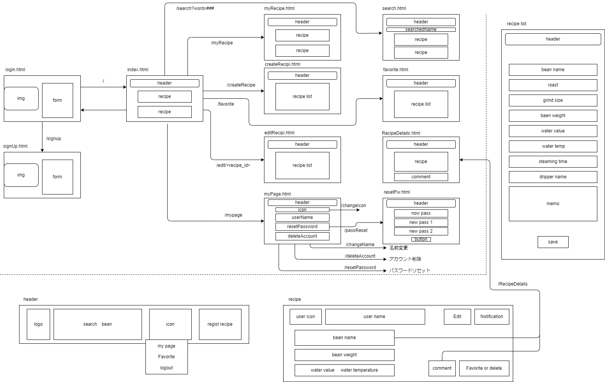

## アプリケーション名
「 BrewShare 」

## アプリケーション概要
コーヒーの淹れ方をレシピとして保存、共有することでコーヒーの淹れ方を広げる手伝いを行うアプリケーションです。

## 目指した課題解決
コーヒーの淹れ方はインターネットに多くの情報がありますが、豆の重さに対してのお湯の量や温度等、人によって異なる方法があり、さらに豆の種類によっても変える必要があるため、自分にとって一番おいしい淹れ方を見つけて、いつも安定した味で楽しむのは簡単ではないといった課題がありました。そこで、ユーザーが自分好みのおいしい淹れ方を見つけ、安定して楽しむことをサポートするアプリを作成しました。

## URL
http://brewshare.jp:8080/

##　アカウント
新規登録からメールアドレスを使用して登録
メールアドレスに認証用のメールが送信されるのでそこからアクセスすることでログインできるようになる。

## 利用方法
- 未ログインユーザー : 他のユーザーのレシピがランダムで表示されるホーム画面と、コーヒー豆の種類でのレシピ検索が可能

- ログインユーザー : 未ログインユーザーが使用できる機能に加え、コメント機能やブックマーク機能を使用できる他、レシピの追加や削除、編集などの基本的な操作が可能

- コメント機能 : ログインユーザーはレシピにコメントが出来る。またコメントが来ると自身のレシピの右上のコメントアイコンの色が赤に変わりコメントが来たことを表示する。

- ユーザー情報編集 : ログインユーザーについてはアカウント名やパスワード、ユーザーアイコンの編集をマイページから行うことが出来る。またパスワードを忘れた際は仮のパスワードを生成してユーザーにメール送信を行う。

## データベース設計

## 画面遷移図

